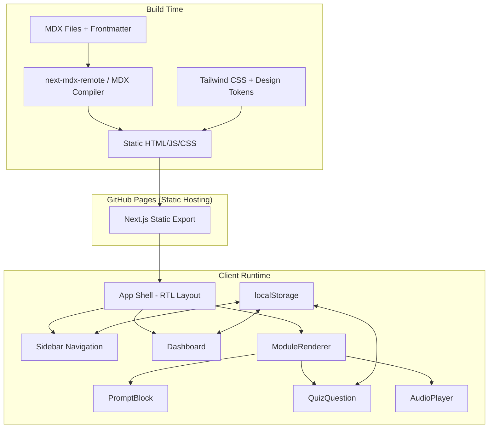
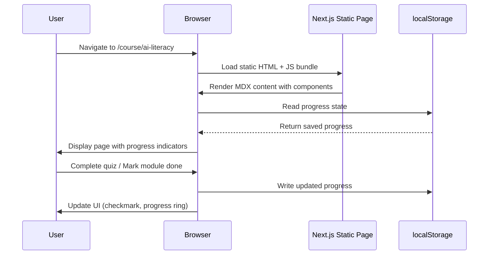
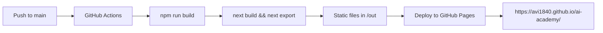

# מסמך עיצוב — "המקפצה" (The Springboard)

## סקירה כללית (Overview)

"המקפצה" היא אפליקציית Next.js סטטית (SSG) המשמשת כפלטפורמת למידת AI פרימיום עבור מובילי AI במגזר הציבורי בישראל. הפלטפורמה מחליפה אתר HTML סטטי קיים באפליקציה מודרנית עם עיצוב בהשראת Anthropic, ממשק עברי מלא ב-RTL, ו-12 קורסים מעשיים בבינה מלאכותית.

### עקרונות עיצוב מרכזיים

- **Client-side only** — אין שרת, אין PII, כל הנתונים ב-localStorage
- **Static Site Generation** — כל הדפים נבנים בזמן build ומוגשים כ-static assets ב-GitHub Pages
- **RTL-first** — כל ה-layout מבוסס על CSS logical properties
- **Content-driven** — תוכן הקורסים ב-MDX עם frontmatter מובנה
- **Anthropic Design Language** — מינימליסטי, חם, עם whitespace נדיב

### תרשים ארכיטקטורה ברמה גבוהה



---

## ארכיטקטורה (Architecture)

### מבנה תיקיות הפרויקט

```
hamakpetza/
├── public/
│   └── audio/                    # קבצי שמע NotebookLM
├── content/
│   └── courses/
│       ├── 01-ai-literacy.mdx
│       ├── 02-model-map.mdx
│       ├── 03-prompt-engineering.mdx
│       ├── 04-ai-writing.mdx
│       ├── 05-ai-data-analysis.mdx
│       ├── 06-ai-research.mdx
│       ├── 07-ai-strategic-thinking.mdx
│       ├── 08-ai-ethics-gov.mdx
│       ├── 09-ai-public-service.mdx
│       ├── 10-ai-automation.mdx
│       ├── 11-rag.mdx
│       └── 12-claude-code.mdx
├── src/
│   ├── app/
│   │   ├── layout.tsx            # Root layout (RTL, fonts, metadata)
│   │   ├── page.tsx              # Dashboard (דף הבית)
│   │   ├── course/
│   │   │   └── [slug]/
│   │   │       └── page.tsx      # Dynamic course page (SSG)
│   │   └── not-found.tsx         # 404 page
│   ├── components/
│   │   ├── layout/
│   │   │   ├── Sidebar.tsx
│   │   │   ├── SidebarToggle.tsx
│   │   │   └── AppShell.tsx
│   │   ├── dashboard/
│   │   │   ├── Dashboard.tsx
│   │   │   ├── DomainCard.tsx
│   │   │   ├── ProgressRing.tsx
│   │   │   └── PathSelector.tsx
│   │   ├── course/
│   │   │   ├── ModuleRenderer.tsx
│   │   │   ├── CourseHeader.tsx
│   │   │   ├── CourseNav.tsx
│   │   │   └── WhatsAppShare.tsx
│   │   └── mdx/
│   │       ├── PromptBlock.tsx
│   │       ├── QuizQuestion.tsx
│   │       ├── KeyTerms.tsx
│   │       └── AudioPlayer.tsx
│   ├── lib/
│   │   ├── courses.ts            # Course data loading & metadata
│   │   ├── progress.ts           # localStorage progress API
│   │   └── mdx.ts                # MDX compilation utilities
│   ├── data/
│   │   └── course-catalog.ts     # Static course catalog (domains, paths)
│   └── styles/
│       └── globals.css           # Tailwind base + custom styles
├── tailwind.config.ts
├── next.config.mjs
└── package.json
```

### אסטרטגיית ניתוב (Routing Strategy)

| Route | Component | Generation |
|-------|-----------|------------|
| `/` | Dashboard | SSG |
| `/course/[slug]` | ModuleRenderer | SSG via `generateStaticParams` |
| `/404` | NotFound | SSG |

כל הנתיבים נבנים סטטית בזמן build באמצעות `generateStaticParams` שמחזיר את 12 ה-slugs מתוך תיקיית `content/courses/`. ה-`next.config.mjs` מוגדר עם `output: 'export'` לייצוא סטטי מלא.

### זרימת נתונים (Data Flow)



---

## רכיבים וממשקים (Components and Interfaces)

### 1. AppShell (`src/components/layout/AppShell.tsx`)

רכיב עטיפה ראשי שמנהל את ה-layout הכולל: Sidebar + Main Content Area.

```typescript
interface AppShellProps {
  children: React.ReactNode;
}
```

- מנהל את מצב פתיחה/סגירה של ה-Sidebar
- מגדיר את ה-grid layout הראשי: sidebar (קבוע/מתקפל) + main content (max-w-3xl)
- מגיב ל-breakpoint של 768px לקביעת מצב ברירת מחדל

### 2. Sidebar (`src/components/layout/Sidebar.tsx`)

```typescript
interface SidebarProps {
  isOpen: boolean;
  onToggle: () => void;
  currentSlug: string | null;
}
```

- מציג 12 קורסים מקובצים לפי 6 תחומי למידה (LearningDomain)
- מצב מכווץ: אייקונים בלבד לכל תחום
- מצב מורחב: רשימת קורסים מלאה עם סטטוס השלמה (checkmark)
- הקורס הפעיל מודגש בצבע accent (`#d97757`)
- מעבר חלק עם CSS transition
- מתחת ל-768px: overlay עם hamburger button

### 3. Dashboard (`src/components/dashboard/Dashboard.tsx`)

```typescript
interface DashboardProps {
  progress: ProgressState;
  onPathSelect: (path: LearningPath) => void;
}
```

- מציג 6 כרטיסי תחום (DomainCard) עם ProgressRing לכל אחד
- אחוז השלמה כולל מחושב מ-modules שהושלמו / 12
- 3 מסלולי למידה עם הדגשה ויזואלית
- ציר זמן 24 שבועות עם milestones
- קרדיט מחבר: "אביעד יצחקי, מוביל AI ושותפויות, מינהלי גמלאות ביטוח לאומי"
- כפתור שיתוף WhatsApp להתקדמות כוללת

### 4. DomainCard (`src/components/dashboard/DomainCard.tsx`)

```typescript
interface DomainCardProps {
  domain: LearningDomain;
  courses: CourseMetadata[];
  completedCount: number;
}
```

- כרטיס ויזואלי לכל תחום למידה
- ProgressRing מעגלי עם אחוז השלמה
- רשימת קורסים בתחום עם סטטוס

### 5. ModuleRenderer (`src/components/course/ModuleRenderer.tsx`)

```typescript
interface ModuleRendererProps {
  source: MDXRemoteSerializeResult;
  frontmatter: CourseFrontmatter;
}
```

- מרנדר תוכן MDX עם Tailwind Typography (`prose` class)
- מזריק רכיבים מותאמים: `PromptBlock`, `QuizQuestion`, `KeyTerms`
- מציג header עם metadata מ-frontmatter (כותרת, משך, קהל יעד, מספר תרגילים)
- טיפוגרפיה: serif לגוף הטקסט, sans-serif לכותרות
- במקרה של רכיב לא תקין — מציג error placeholder במקום crash

### 6. PromptBlock (`src/components/mdx/PromptBlock.tsx`)

```typescript
interface PromptBlockProps {
  children: string;
  title?: string;
}
```

- מציג טקסט פרומפט בפונט monospace בתוך container מובחן
- כפתור העתקה ללוח בפינה השמאלית-עליונה (RTL)
- לאחר העתקה מוצלחת: אייקון ✓ למשך 2 שניות
- fallback ל-text selection אם Clipboard API לא זמין
- שומר whitespace ושורות חדשות
- גלילה אופקית במובייל לשורות ארוכות

### 7. AudioPlayer (`src/components/mdx/AudioPlayer.tsx`)

```typescript
interface AudioPlayerProps {
  src: string;
  title: string;
}
```

- דביק (sticky) בראש ה-viewport
- פקדי play/pause/seek
- תצוגת זמן נוכחי ומשך כולל
- מוסתר כשאין audio URL ב-frontmatter
- ממשיך לנגן בניווט בין דפים (state ב-AppShell)
- ARIA labels בעברית לנגישות
- layout קומפקטי מתחת ל-768px

### 8. QuizQuestion (`src/components/mdx/QuizQuestion.tsx`)

```typescript
interface QuizQuestionProps {
  question: string;
  options: string[];
  correctIndex: number;
  explanation: string;
  id: string;
}
```

- מציג שאלה עם אפשרויות בחירה
- בבחירת תשובה: סימון ויזואלי נכון/לא נכון
- כפתור "חשוף תשובה" שמציג את התשובה הנכונה + הסבר
- שומר מצב תשובה ב-localStorage

### 9. WhatsAppShare (`src/components/course/WhatsAppShare.tsx`)

```typescript
interface WhatsAppShareProps {
  title: string;
  url: string;
  type: 'course' | 'progress';
}
```

- פותח WhatsApp share dialog עם הודעה מעוצבת בעברית
- כולל שם הקורס וקישור ישיר
- URL: `https://wa.me/?text={encodedMessage}`

### 10. CourseNav (`src/components/course/CourseNav.tsx`)

```typescript
interface CourseNavProps {
  prevCourse: CourseMetadata | null;
  nextCourse: CourseMetadata | null;
}
```

- קישורי ניווט קורס קודם/הבא בתחתית כל דף קורס

---

## מודלי נתונים (Data Models)

### CourseFrontmatter (MDX Frontmatter Schema)

```typescript
interface CourseFrontmatter {
  slug: string;           // e.g. "ai-literacy"
  title: string;          // e.g. "אוריינות AI ועבודה אחראית"
  courseNumber: number;    // 1-12
  duration: string;       // e.g. "35 דקות קריאה"
  audience: string;       // e.g. "כל עובדי המדינה"
  exerciseCount: number;  // e.g. 3
  domain: LearningDomain;
  path: LearningPath;
  audioUrl?: string;      // Optional NotebookLM audio URL
  description: string;    // Short description for cards/meta
}
```

### LearningDomain

```typescript
type LearningDomain =
  | 'foundation'
  | 'ai-engineering'
  | 'ai-assisted-dev'
  | 'building-ai-products'
  | 'ai-for-gov'
  | 'ai-product-leadership';

interface DomainInfo {
  id: LearningDomain;
  nameHe: string;        // e.g. "בסיס"
  icon: string;          // Emoji or icon identifier
  color: string;         // Domain accent color
  courses: number[];     // Course numbers in this domain
}
```

### LearningPath

```typescript
type LearningPath = 'foundation' | 'applied' | 'advanced';

interface PathInfo {
  id: LearningPath;
  nameHe: string;        // "בסיס" | "יישומי" | "מתקדם"
  courseNumbers: number[];
  description: string;
}
```

### ProgressState (localStorage Schema)

```typescript
interface ProgressState {
  version: 1;
  completedModules: number[];     // Array of course numbers [1, 3, 5]
  quizAnswers: Record<string, {   // keyed by quiz ID
    selectedIndex: number;
    revealed: boolean;
  }>;
  lastVisited: string | null;     // Last visited course slug
  updatedAt: string;              // ISO timestamp
}
```

**localStorage key:** `hamakpetza_progress`

### Course Catalog (Static Data)

```typescript
// src/data/course-catalog.ts
const COURSE_CATALOG: CourseMetadata[] = [
  { courseNumber: 1, slug: 'ai-literacy', domain: 'foundation', path: 'foundation', ... },
  { courseNumber: 2, slug: 'model-map', domain: 'foundation', path: 'foundation', ... },
  // ... all 12 courses
];

const DOMAINS: DomainInfo[] = [
  { id: 'foundation', nameHe: 'בסיס', courses: [1, 2], ... },
  { id: 'ai-engineering', nameHe: 'הנדסת AI', courses: [3], ... },
  // ... all 6 domains
];

const PATHS: PathInfo[] = [
  { id: 'foundation', nameHe: 'בסיס', courseNumbers: [1, 2, 8], ... },
  { id: 'applied', nameHe: 'יישומי', courseNumbers: [3, 4, 5, 6, 7, 9, 10], ... },
  { id: 'advanced', nameHe: 'מתקדם', courseNumbers: [11, 12], ... },
];
```

### MDX Component Registry

```typescript
// Components available in MDX files
const mdxComponents = {
  PromptBlock,
  QuizQuestion,
  KeyTerms,
  AudioPlayer,
};
```

### MDX Frontmatter Example

```yaml
---
slug: "ai-literacy"
title: "אוריינות AI ועבודה אחראית"
courseNumber: 1
duration: "35 דקות קריאה"
audience: "כל עובדי המדינה"
exerciseCount: 3
domain: "foundation"
path: "foundation"
audioUrl: "/audio/course-01.mp3"
description: "מה AI יכול ומה לא, איך לעבוד איתו נכון, ולמה זה חשוב במיוחד בשירות הציבורי"
---
```

### Design System Tokens (Tailwind Config)

```typescript
// tailwind.config.ts
const config = {
  theme: {
    extend: {
      colors: {
        bg: '#faf9f5',
        text: '#141413',
        accent: '#d97757',
        secondary: '#6a9bcc',
        'accent-light': '#f5ebe6',
        'secondary-light': '#e8f0f7',
      },
      fontFamily: {
        heading: ['Heebo', 'Assistant', 'Rubik', 'sans-serif'],
        body: ['"Frank Ruhl Libre"', 'Alef', 'serif'],
        mono: ['Fira Code', 'monospace'],
      },
      fontSize: {
        base: ['18px', { lineHeight: '1.7' }],
      },
      maxWidth: {
        reading: '48rem', // max-w-3xl
      },
      typography: {
        DEFAULT: {
          css: {
            direction: 'rtl',
            fontFamily: '"Frank Ruhl Libre", Alef, serif',
            fontSize: '18px',
            lineHeight: '1.7',
            color: '#141413',
            h1: { fontFamily: 'Heebo, sans-serif' },
            h2: { fontFamily: 'Heebo, sans-serif' },
            h3: { fontFamily: 'Heebo, sans-serif' },
          },
        },
      },
    },
  },
  plugins: [require('@tailwindcss/typography')],
};
```

### Next.js Configuration

```javascript
// next.config.mjs
const nextConfig = {
  output: 'export',
  basePath: '/ai-academy',
  images: { unoptimized: true },
  trailingSlash: true,
};
```

### Content Security Policy

```html
<meta http-equiv="Content-Security-Policy"
  content="default-src 'self';
    script-src 'self';
    style-src 'self' 'unsafe-inline' https://fonts.googleapis.com;
    font-src https://fonts.gstatic.com;
    img-src 'self' data:;
    media-src 'self';
    connect-src 'self';">
```


---

## תכונות נכונות (Correctness Properties)

*תכונה (property) היא מאפיין או התנהגות שצריכים להתקיים בכל הרצה תקינה של המערכת — למעשה, הצהרה פורמלית על מה שהמערכת אמורה לעשות. תכונות משמשות כגשר בין מפרטים קריאים לאדם לבין ערבויות נכונות הניתנות לאימות על ידי מכונה.*

### Property 1: RTL attributes on all pages

*For any* page generated by the platform, the root HTML element must contain `dir="rtl"` and `lang="he"` attributes.

**Validates: Requirements 1.1**

### Property 2: Sidebar groups all courses by domain

*For any* valid course catalog, the Sidebar must display all 12 courses, and each course must appear under exactly one of the 6 LearningDomains.

**Validates: Requirements 2.1**

### Property 3: Sidebar active course indicator

*For any* course slug passed as the current active course, the Sidebar must mark exactly that course as active and no other course.

**Validates: Requirements 2.4**

### Property 4: Sidebar completion status reflects progress

*For any* ProgressState containing a set of completed module numbers, the Sidebar must show a completion indicator for exactly those modules and no others.

**Validates: Requirements 2.6**

### Property 5: Dashboard completion percentage calculation

*For any* subset of completed modules from the set {1..12}, the overall completion percentage must equal `completedModules.length / 12 * 100`.

**Validates: Requirements 3.2**

### Property 6: Domain progress updates on course completion

*For any* course completion event, the LearningDomain that contains that course must have its progress count incremented by exactly 1.

**Validates: Requirements 3.4**

### Property 7: Progress persistence round-trip

*For any* valid ProgressState, writing it to localStorage and then reading it back must produce an equivalent ProgressState object.

**Validates: Requirements 3.5, 3.6**

### Property 8: MDX custom component rendering

*For any* registered custom component name (PromptBlock, QuizQuestion, KeyTerms), an MDX string containing that component tag must render without error and produce a non-empty output.

**Validates: Requirements 4.2**

### Property 9: Frontmatter metadata extraction

*For any* valid CourseFrontmatter object, serializing it to YAML frontmatter and then parsing it back must produce an equivalent object with all fields preserved.

**Validates: Requirements 4.4**

### Property 10: PromptBlock clipboard copy

*For any* string passed as children to PromptBlock, invoking the copy action must place that exact string on the clipboard.

**Validates: Requirements 5.3**

### Property 11: PromptBlock whitespace preservation

*For any* multi-line string with arbitrary whitespace, the PromptBlock rendered output must preserve all whitespace characters and line breaks from the input.

**Validates: Requirements 5.6**

### Property 12: AudioPlayer visibility based on audioUrl

*For any* CourseFrontmatter, the AudioPlayer must be visible if and only if the frontmatter contains a non-empty `audioUrl` field.

**Validates: Requirements 6.4, 6.5**

### Property 13: QuizQuestion correct/incorrect indication

*For any* QuizQuestion with a given `correctIndex` and *for any* selected answer index, the component must indicate "correct" if and only if `selectedIndex === correctIndex`.

**Validates: Requirements 7.2**

### Property 14: QuizQuestion reveal toggle

*For any* QuizQuestion, the explanation must be hidden when `revealed` is false and visible when `revealed` is true.

**Validates: Requirements 7.4, 7.5**

### Property 15: QuizQuestion state persistence

*For any* quiz answer event (question ID, selected index, revealed state), writing the state to localStorage and reading it back must produce an equivalent answer state.

**Validates: Requirements 7.6**

### Property 16: WhatsApp share URL generation

*For any* course title (Hebrew string) and URL, the generated WhatsApp share URL must contain the URL-encoded course title and the URL-encoded course link.

**Validates: Requirements 8.2, 8.4**

### Property 17: Content migration text preservation

*For all* 12 course modules, the visible text content extracted from the rendered MDX output must be equivalent to the visible text content extracted from the original HTML page.

**Validates: Requirements 9.5**

### Property 18: Color contrast ratios meet WCAG AA

*For any* text/background color pair defined in the DesignSystem tokens, the computed contrast ratio must be at least 4.5:1 for normal text and 3:1 for large text.

**Validates: Requirements 11.2**

### Property 19: Progress data contains no PII

*For any* ProgressState object stored in localStorage, the serialized JSON must not contain fields or values matching PII patterns (Israeli ID numbers, email addresses, phone numbers, names).

**Validates: Requirements 12.2**

### Property 20: Course catalog integrity

*For any* valid course catalog, it must contain exactly 12 courses, each assigned to exactly one of 6 LearningDomains and exactly one of 3 LearningPaths, with no course unassigned and no duplicates.

**Validates: Requirements 14.1, 14.2, 14.3**

### Property 21: Path selection highlights correct courses

*For any* selected LearningPath, the set of highlighted course numbers must exactly match the `courseNumbers` array defined for that path in the catalog.

**Validates: Requirements 14.5**

### Property 22: Route-to-content mapping

*For any* course in the catalog, navigating to `/course/{slug}` must load the MDX file whose frontmatter `slug` field matches the URL parameter.

**Validates: Requirements 15.1, 15.2**

### Property 23: Course navigation prev/next links

*For any* course with `courseNumber` N where 1 < N < 12, the page must display a "previous" link to course N-1 and a "next" link to course N+1. For course 1, no previous link. For course 12, no next link.

**Validates: Requirements 15.5**

### Property 24: PII pattern detection

*For any* string containing an Israeli ID number (9 digits), email address, or Israeli phone number pattern, the PII scanner must flag it as a match.

**Validates: Requirements 16.1, 16.2**

### Property 25: PII scanner file type filtering

*For any* file path, the PII scanner must process it if and only if its extension is one of `.ts`, `.tsx`, `.mdx`, `.md`, `.json`.

**Validates: Requirements 16.4**


---

## טיפול בשגיאות (Error Handling)

### שגיאות ברמת הרכיבים

| רכיב | שגיאה אפשרית | טיפול |
|-------|---------------|-------|
| ModuleRenderer | רכיב MDX לא תקין | הצגת error placeholder עם שם הרכיב החסר, ללא crash |
| ModuleRenderer | קובץ MDX לא נמצא | הפניה לדף 404 מעוצב |
| PromptBlock | Clipboard API לא זמין | fallback ל-text selection + tooltip הסבר |
| AudioPlayer | קובץ שמע לא נטען | הצגת הודעת שגיאה בתוך הנגן, ללא crash |
| QuizQuestion | localStorage לא זמין | המשך עבודה ללא שמירת מצב, הצגת warning |
| Dashboard | localStorage ריק/פגום | אתחול ProgressState ברירת מחדל (ריק) |
| Sidebar | Course catalog חסר | הצגת skeleton/loading state |

### שגיאות ברמת הניתוב

- **404 — נתיב לא קיים:** דף 404 מעוצב בעברית עם קישור חזרה ל-Dashboard
- **Slug לא תקין:** `generateStaticParams` מייצר רק slugs תקינים; כל slug אחר → 404

### שגיאות ברמת הנתונים

- **localStorage פגום (JSON parse error):** catch ב-`progress.ts`, אתחול מחדש עם ProgressState ריק
- **Frontmatter חסר שדות:** ערכי ברירת מחדל מוגדרים ב-`CourseFrontmatter` interface
- **Version mismatch ב-ProgressState:** migration function שמעדכנת את המבנה לגרסה הנוכחית

### אסטרטגיית Error Boundaries

```
AppShell (Error Boundary — root)
├── Sidebar (graceful degradation)
├── Dashboard (Error Boundary — page level)
│   └── DomainCard (isolated errors)
└── ModuleRenderer (Error Boundary — page level)
    ├── PromptBlock (try/catch per block)
    ├── QuizQuestion (try/catch per question)
    └── AudioPlayer (graceful hide on error)
```

---

## אסטרטגיית בדיקות (Testing Strategy)

### גישה כפולה: Unit Tests + Property-Based Tests

הפלטפורמה משתמשת בגישת בדיקות כפולה:
- **Unit tests** — לדוגמאות ספציפיות, edge cases, ושגיאות
- **Property-based tests** — לתכונות אוניברסליות על כל הקלטים

שתי הגישות משלימות זו את זו ונדרשות לכיסוי מקיף.

### כלים

- **Test Runner:** Vitest
- **Property-Based Testing:** `fast-check` (ספריית PBT ל-TypeScript)
- **Component Testing:** React Testing Library
- **Accessibility Testing:** `jest-axe` (לבדיקות נגישות בסיסיות)

### קונפיגורציית Property Tests

- מינימום 100 איטרציות לכל property test
- כל property test מתויג בהערה שמפנה ל-design property
- פורמט תיוג: `Feature: hamakpetza-platform, Property {number}: {property_text}`
- כל correctness property ממומש על ידי property-based test **יחיד**

### חלוקת בדיקות

#### Property-Based Tests (fast-check)

| Property | תיאור | Generator |
|----------|--------|-----------|
| P5 | חישוב אחוז השלמה | `fc.subarray([1..12])` |
| P7 | Round-trip שמירת progress | `fc.record({ completedModules: fc.subarray(...), ... })` |
| P9 | Round-trip frontmatter | `fc.record({ slug: fc.string(), title: fc.string(), ... })` |
| P10 | העתקת PromptBlock | `fc.string()` |
| P11 | שימור whitespace | `fc.string().filter(s => s.includes('\n'))` |
| P13 | QuizQuestion נכון/לא נכון | `fc.nat(3)` for correctIndex, `fc.nat(3)` for selected |
| P14 | QuizQuestion reveal toggle | `fc.boolean()` for revealed state |
| P15 | Round-trip quiz state | `fc.record({ selectedIndex: fc.nat(), revealed: fc.boolean() })` |
| P16 | WhatsApp URL generation | `fc.tuple(fc.unicodeString(), fc.webUrl())` |
| P18 | ניגודיות צבעים | `fc.constantFrom(...colorPairs)` |
| P19 | Progress ללא PII | `fc.record(...)` for ProgressState |
| P20 | שלמות קטלוג קורסים | Validation on static data |
| P23 | ניווט prev/next | `fc.integer({ min: 1, max: 12 })` |
| P24 | זיהוי PII | `fc.oneof(israeliId, email, phone)` generators |
| P25 | סינון סוגי קבצים | `fc.tuple(fc.string(), fc.constantFrom('.ts', '.tsx', '.mdx', '.md', '.json', '.png', '.jpg'))` |

#### Unit Tests (Vitest + React Testing Library)

- **PromptBlock:** רנדור, כפתור העתקה, fallback
- **AudioPlayer:** הצגה/הסתרה לפי audioUrl, פקדי נגינה
- **QuizQuestion:** רנדור שאלה, בחירת תשובה, חשיפת תשובה
- **Sidebar:** מצב מכווץ/מורחב, קורס פעיל, סטטוס השלמה
- **Dashboard:** הצגת 6 תחומים, 3 מסלולים, קרדיט מחבר
- **WhatsAppShare:** יצירת URL תקין
- **ModuleRenderer:** רנדור MDX בסיסי, error placeholder לרכיב לא תקין
- **progress.ts:** אתחול מ-localStorage ריק, טיפול ב-JSON פגום
- **404 page:** הצגת דף 404 עם ניווט חזרה

#### Edge Cases

- localStorage ריק או פגום (12.4)
- Clipboard API לא זמין (5.5)
- רכיב MDX לא תקין (4.6)
- URL של קורס לא קיים (15.3)

### אסטרטגיית Deployment



- **Build:** `next build` עם `output: 'export'`
- **Base Path:** `/ai-academy` (מותאם ל-GitHub Pages repo name)
- **Branch:** `main` → GitHub Actions → deploy to `gh-pages` branch
- **PR Convention:** `feat: metamorphosis -> "המקפצה"`
- **Static Assets:** כל הקבצים ב-`/out` כולל HTML, JS, CSS, audio
- **No Server:** אין צורך ב-Node.js server; הכל static files

